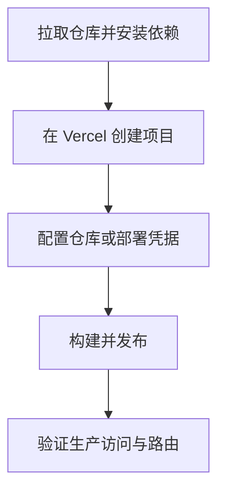

# 全栈思维跃迁（fullstack-vue）

基于 Vue 3 + TypeScript + Vite + Tailwind CSS 的全栈开发分享网站，主线围绕 `UI = f(States)` 展开，内容按章节组织。

## 项目概览

- 定位：全栈开发知识分享与教学演示
- 内容：前言 + 第 1~6 章 + 结语
- 技术栈：Vue 3、TypeScript、Vite、Vue Router、Pinia、Tailwind CSS 4
- 包管理器：`pnpm`
- 构建产物：`dist/`

## 章节路由

- 首页：`/`
- 前言：`/intro`
- 第一章：`/chapter/1`
- 第二章：`/chapter/2`
- 第三章：`/chapter/3`
- 第四章：`/chapter/4`
- 第五章：`/chapter/5`
- 第六章：`/chapter/6`
- 结语：`/epilogue`

## 目录结构

```text
src/
├── assets/styles/     # 全局样式（Tailwind 入口）
├── components/        # 组件（common/layout）
├── data/              # 章节静态数据
├── router/            # 路由与标题守卫
├── stores/            # Pinia 状态管理
├── types/             # TypeScript 类型
└── views/             # 页面视图
```

## 环境要求

- Node.js：`^20.19.0` 或 `>=22.12.0`
- pnpm：建议 `10+`

## 本地开发

```bash
pnpm install
pnpm dev
```

常用命令：

```bash
pnpm type-check
pnpm build
pnpm build-only
pnpm preview
pnpm format
```

## 快速部署（Vercel）

仓库已包含 `vercel.json`（Vite 构建 + SPA rewrite）和 GitHub Actions 工作流，可直接用于部署。



### 方案 A：Vercel 控制台部署

1. 在 Vercel 中 `Add New Project` 并导入仓库。
2. 使用仓库默认构建配置（会读取 `vercel.json`）：
   - Install Command：`pnpm install --frozen-lockfile`
   - Build Command：`pnpm build`
   - Output Directory：`dist`
3. 点击 `Deploy`，部署完成后验证如 `/chapter/3` 的直达访问。

### 方案 B：GitHub Actions 自动部署

工作流文件：`.github/workflows/vercel-deploy.yml`  
触发条件：推送到 `master`，或手动触发 `workflow_dispatch`。

1. 在仓库 Secrets 中配置：
   - `VERCEL_TOKEN`
   - `VERCEL_ORG_ID`
   - `VERCEL_PROJECT_ID`
2. 推送到 `master` 后，流水线会自动执行安装、拉取配置、构建、生产部署。

### 方案 C：本地 CLI 手动部署

```bash
pnpm dlx vercel@latest pull --yes --environment=production --token=<your_vercel_token>
pnpm dlx vercel@latest build --prod --token=<your_vercel_token>
pnpm dlx vercel@latest deploy --prebuilt --prod --token=<your_vercel_token>
```

## 协作建议

- 推荐 IDE：VS Code + Vue (Official)（禁用 Vetur）
- 新增章节请同步更新：
  - `src/data/chapters.ts`
  - `src/router/index.ts`
  - `src/views/` 对应页面组件
